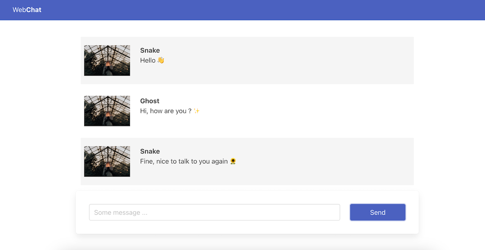

## Webchat
A realtime chat app made with Express and SocketIO.


### Installation
1. Clone the repository:
```
git clone https://github.com/jsonfm/express-webchat.git
```
2. Install node dependencies:
```
npm install
```

3. Configure `.env` variables: 
```
touch .env
```
After complete the corresponding fields. Look `.env.example` file for more information.
```
PORT=3000
```

### ⚡️ Development
```
npm run dev
```

### 🚀 Production
```
npm run start
```

### 🧩 Technologies
- Express
- SocketIO
- ETA templates engine
- BulmaCSS
